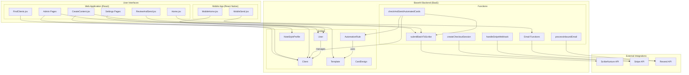

```mermaid
graph TD
    subgraph "User Interfaces"
        subgraph "Web Application (React)"
            direction LR
            P1["Home.jsx"]
            P2["FindClients.jsx"]
            P3["CreateContent.jsx"]
            P4["ReviewAndSend.jsx"]
            P5["Admin Pages"]
            P6["Settings Pages"]
        end
        subgraph "Mobile App (React Native)"
            direction LR
            M1["MobileHome.jsx"]
            M2["MobileSend.jsx"]
        end
    end

    subgraph "Base44 Backend (BaaS)"
        subgraph "Functions"
            F1["submitBatchToScribe"]
            F2["checkAndSendAutomatedCards"]
            F3["createCheckoutSession"]
            F4["handleStripeWebhook"]
            F5["Email Functions"]
            F6["processInboundEmail"]
        end
        subgraph "Entities"
            E1["User"]
            E2["Client"]
            E3["Template"]
            E4["AutomationRule"]
            E5["CardDesign"]
            E6["NoteStyleProfile"]
        end
    end

    subgraph "External Integrations"
        I1["ScribeNurture API"]
        I2["Stripe API"]
        I3["Resend API"]
    end

    P1 --> F5
    P2 --> E2
    P3 --> E3
    P3 --> E6
    P4 --> F1
    P5 --> E1
    P5 --> E2
    P6 --> E1

    M1 --> E2
    M2 --> F1

    F1 --> I1
    F2 --> E4
    F2 --> E2
    F2 --> F1
    F3 --> I2
    F4 --> I2
    F5 --> I3
    F6 --> I3

    E1 -- "manages" --> E2
    E4 -- "uses" --> E3
```
